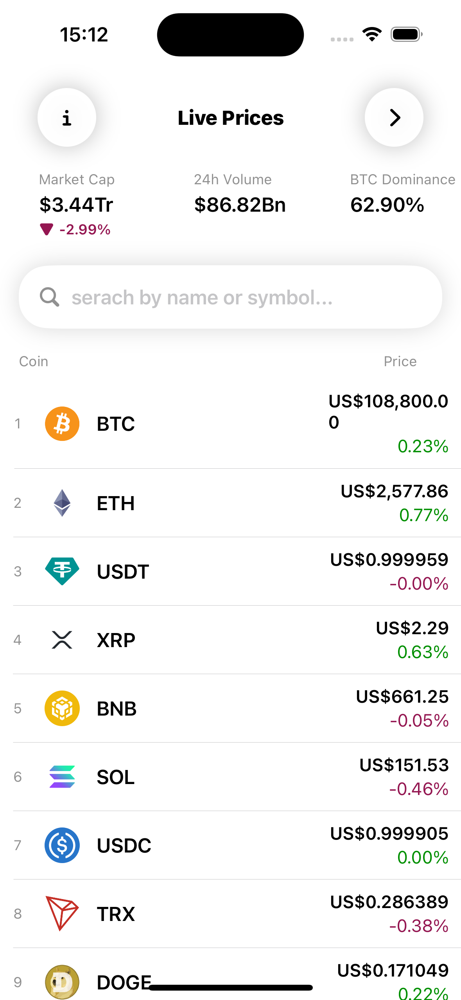
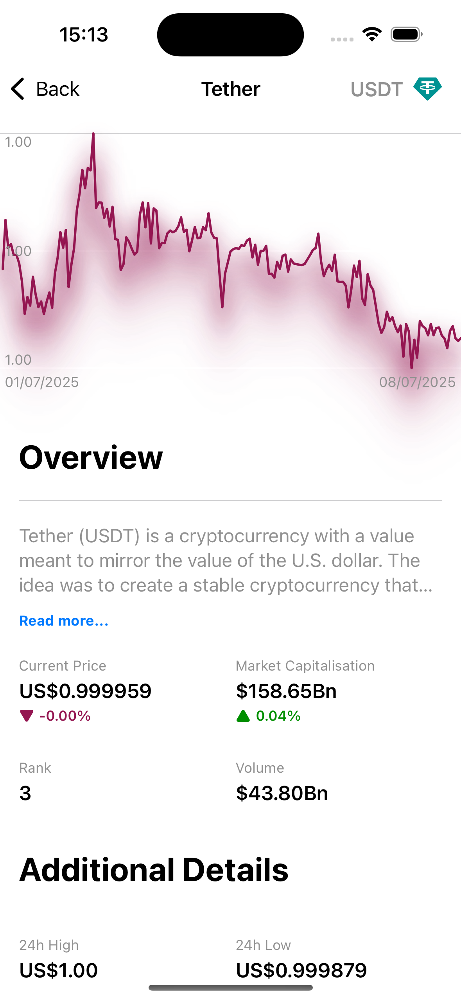
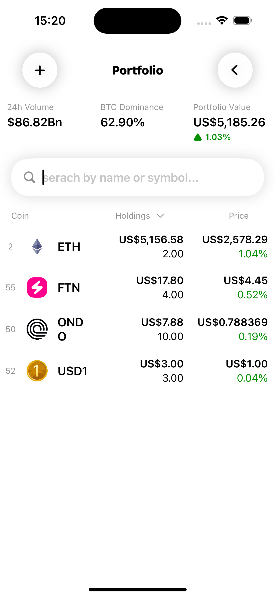

# CryptoTracker


A modern cryptocurrency tracking app built with **SwiftUI** for iOS. Track live prices, manage your portfolio, and explore detailed statistics for thousands of cryptocurrencies—all powered by the [CoinGecko API](https://www.coingecko.com/).

---

## Features

- **Live Prices:** View real-time prices and market data for top cryptocurrencies.
- **Portfolio Management:** Add, edit, and track your personal crypto holdings with instant portfolio value updates.
- **Detailed Coin Info:** Dive into each coin for charts, statistics, descriptions, and links to official resources.
- **Global Market Stats:** See total market cap, 24h volume, and Bitcoin dominance at a glance.
- **Search & Sort:** Quickly find coins by name or symbol, and sort by rank, price, or holdings.
- **Beautiful UI:** Clean, modern interface with light/dark mode support and smooth animations.

---

## Screenshots
<p align="center">
  
   
   
</p>


## Getting Started

### Prerequisites
- Xcode 15+
- iOS 17+

### Setup
1. Clone the repository:
   ```sh
   git clone https://github.com/yourusername/CryptoTracker.git
   ```
2. Open `Crypto.xcodeproj` in Xcode.
3. Build and run on your simulator or device.

---

## Architecture

- **SwiftUI:** Declarative UI for all screens and components.
- **Combine:** Reactive data flow for live updates and state management.
- **MVVM:** Clear separation of views, view models, and models.
- **Core Data:** Persistent storage for your portfolio.
- **Networking:** All data fetched from the [CoinGecko API](https://www.coingecko.com/).

### Main Modules
- `Core/` — UI components, views, and view models
- `Models/` — Data models for coins, market data, and statistics
- `Services/` — Networking and data services
- `Utilities/` — Helpers for networking, file management, and extensions
- `Assets.xcassets/` — App icons, logos, and color themes

---

## Credits

- **Data:** [CoinGecko API](https://www.coingecko.com/)
- **Logo & Icons:** See `Assets.xcassets/Images/`
- **Inspiration:** Built as a learning project following a YouTube course

---

## Contributing

Pull requests are welcome! For major changes, please open an issue first to discuss what you would like to change.

---

## License

[MIT](LICENSE) (or specify your license here) 
